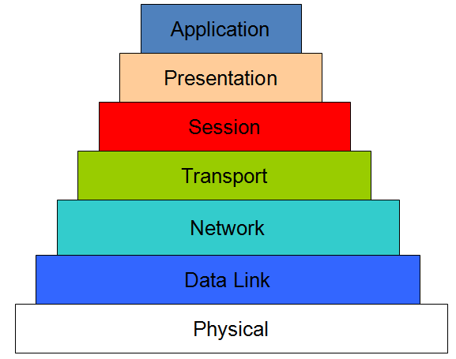
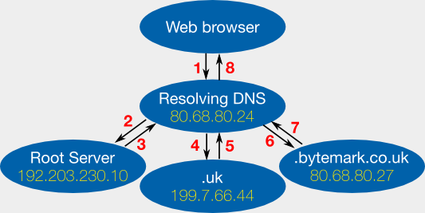

# Understand

Internet is the best invention in the last 50 years, and maybe someone could say that is the best invention in the world.

The truth is that Internet is not perfect and it needs a lot of human value to build a secure service for daily things, for example, reading your mail, visiting a cats' website, downloading creative commons music and films...

Internet is nested in layers called [OSI model](https://en.wikipedia.org/wiki/OSI_model). Seven layers compound the OSI model and each layer offers services for different things.

Top-level layers need their lower layer to offer a service. Your browser doesn't load a website if its transfer protocol doesn't work correctly.

Another important network element are routers, switches and hosts, and using different protocols (BGP, RIP, OSPF) to communicate with each one and make the Internet a computer network that understands how a package travels from EEUU to Spain.

But this is not important here. You'll need to understand how to set up your machine to be accesible for the others and to offer your services for resolving names, having mails accounts under your domain...

The services that you intend to use belong to the application layer. As I said before, this services use services or protocols from lower layers of the OSI model. For example, DNS is an application service, but it needs a transport protocol to resolve the name to the IP. On the other hand, IP is based on network layer IPv4 (or better, IPv6) to be operative for the application layer.

After all, everything is just abstraction. The purpose is having an application layer available, secure and operative.

Now, is time to take action!