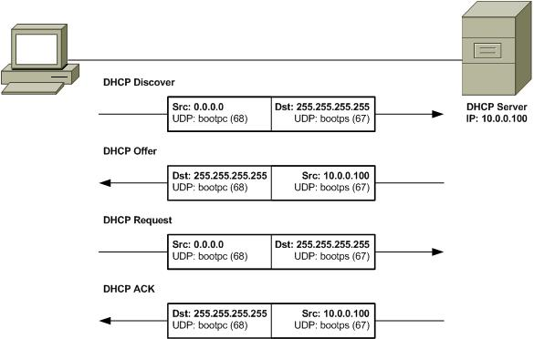
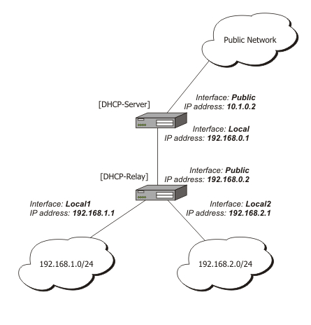
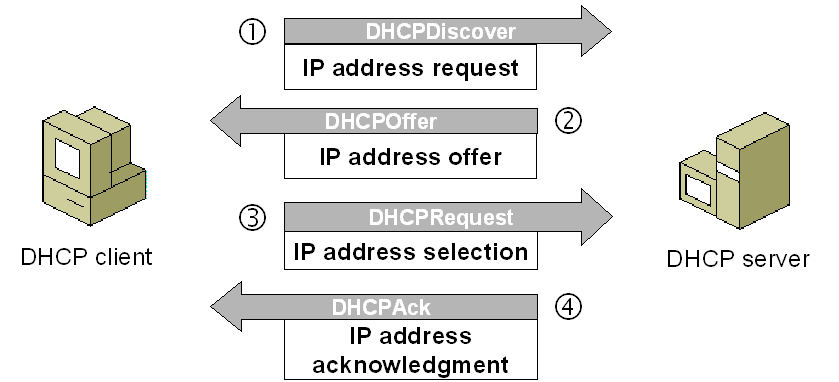

# DHCP

The Dynamic Host Configuration Protocol (*DHCP*) is a standardized networking protocol used in Internet Protocol (IP) networks for dynamically distributing network configuration parameters, such as IP addresses for interfaces and services. With DHCP, computers request IP addresses and networking parameters automatically from a DHCP server, reducing the need for a network administrator or a user to configure these settings manually.

Normally is necessary that DHCP be in the same network, but is possible to set an external network using **DHCP relay** like proxy:

The different messages for DHCP protocol are:

<table>
<tbody><tr><th>

Message Type

</th><th>

Description

</th></tr>
<tr><td>

DHCPDiscover

</td><td>

The first time a DHCP client computer attempts to log on to the network, it requests IP address information from a DHCP server by broadcasting a DHCPDiscover packet. The source IP address in the packet is 0.0.0.0 because the client does not yet have an IP address. The message is either 342 or 576 bytes long—older versions of Windows use a longer message frame.

</td></tr>
<tr><td>

DHCPOffer

</td><td>

Each DHCP server that receives the client DHCPDiscover packet responds with a DHCPOffer packet containing an unleased IP address and additional TCP/IP configuration information, such as the subnet mask and default gateway. More than one DHCP server can respond with a DHCPOffer packet. The client will accept the first DHCPOffer packet it receives. The message is 342 bytes long.

</td></tr>
<tr><td>

DHCPRequest

</td><td>

When a DHCP client receives a DHCPOffer packet, it responds by broadcasting a DHCPRequest packet that contains the offered IP address, and shows acceptance of the offered IP address. The message is either 342 or 576 bytes long, depending on the length of the corresponding DHCPDiscover message.

</td></tr>
<tr><td>

DHCPAcknowledge (DHCPAck)

</td><td>

The selected DHCP server acknowledges the client DHCPRequest for the IP address by sending a DHCPAck packet. At this time the server also forwards any optional configuration parameters. Upon receipt of the DHCPAck, the client can participate on the TCP/IP network and complete its system startup. The message is 342 bytes long.

</td></tr>
<tr><td>

DHCPNak

</td><td>

If the IP address cannot be used by the client because it is no longer valid or is now used by another computer, the DHCP server responds with a DHCPNak packet, and the client must begin the lease process again. Whenever a DHCP server receives a request for an IP address that is invalid according to the scopes that it is configured with, it sends a DHCPNak message to the client.

</td></tr>
<tr><td>

DHCPDecline

</td><td>

If the DHCP client determines the offered configuration parameters are invalid, it sends a DHCPDecline packet to the server, and the client must begin the lease process again.

</td></tr>
<tr><td>

DHCPRelease

</td><td>

A DHCP client sends a DHCPRelease packet to the server to release the IP address and cancel any remaining lease.

</td></tr>
<tr><td>

DHCPInform

</td><td>

DHCPInform is a new DHCP message type, defined in RFC&nbsp;2131, used by computers on the network to request and obtain information from a DHCP server for use in their local configuration. When this message type is used, the sender is already externally configured for its IP address on the network, which may or may not have been obtained using DHCP. This message type is not currently supported by the DHCP service provided in earlier versions of Windows&nbsp;NT Server and may not be recognized by third-party implementations of DHCP software. 

</td></tr>
</tbody></table>

Simply process in one image:

