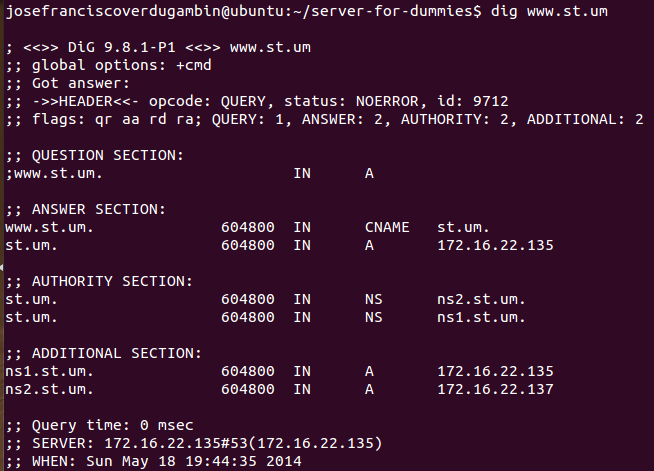

## Your DNS in the client

You need to say to your client to use your DNS for resolving names. Run the script and select this options:

```
1. Install Services > client > DNS
```


This is translated in the script to write in your client the IP of your primary DNS in the system file `/etc/resolv.conf` that is used to resolve queries:

```bash
echo " * Configuring DNS client..."
echo "# Dynamic resolv.conf(5) file for glibc resolver(3) generated by resolvconf(8)
# DO NOT EDIT THIS FILE BY HAND -- YOUR CHANGES WILL BE OVERWRITTEN
nameserver $PRIMARY_DNS
nameserver $SECONDARY_DNS
#search localdomain
" > /etc/resolv.conf
```

You can check connectivity in the client with two commands, both in the client:




