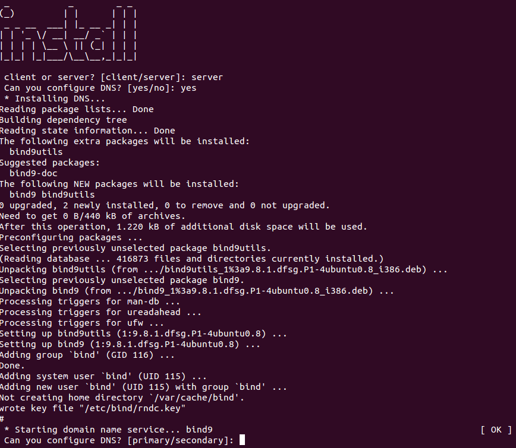

# Your DNS in the server

Server configuration is also simple, but it requires a few extra steps.

```
1. Install Services > client > DNS > [Select primary or secondary]
```



## Primary DNS


1. Install **bind9**, a application to provide DNS services
2. Edit `/etc/resolv.conf` file and add your own direction
3. Set up **bind9** to define your domain database and your secondary IP if is defined.

```
write_config_local_server(){
echo "zone \"$DNS_NAME.\" IN {
  type master;
  file \"/etc/bind/db.$DNS_NAME.zone\";
  allow-transfer {$SECONDARY_DNS;};
  }; " > /etc/bind/named.conf.local
}
```

4. In the domain database write entries to be resolubles main services that use DNS to access it:

```
write_database(){
echo "\$TTL  604800
@ IN  SOA ns1.$DNS_NAME. root.ns1.$DNS_NAME. (
            1   ; Serial
       604800   ; Refresh
        86400   ; Retry
      2419200   ; Expire
       604800 ) ; Negative Cache TTL

@             IN      NS         ns1.$DNS_NAME.
ns1           IN      A          $PRIMARY_DNS
@             IN      NS         ns2.$DNS_NAME.

ns2           IN      A          $SECONDARY_DNS
$DNS_NAME.    IN      A          $PRIMARY_DNS

smtp          IN      CNAME      $DNS_NAME.
pop3          IN      CNAME      $DNS_NAME.
ldap          IN      CNAME      $DNS_NAME.
www           IN      CNAME      $DNS_NAME.
www1          IN      CNAME      $DNS_NAME.
www2          IN      CNAME      $DNS_NAME.
www3          IN      CNAME      $DNS_NAME.
" > /etc/bind/db."$DNS_NAME".zone
}
```

## Secondary DNS


For the secondary server, the configuration is more easy because this use primary server to get information and don't need too more:

```
write_config_local_client(){
echo "zone \"$DNS_NAME.\" IN {
  type slave;
  file \"/var/cache/bind/db.$DNS_NAME.zone\";
  masters {$PRIMARY_DNS;};
};
" > /etc/bind/named.conf.local
}
```
