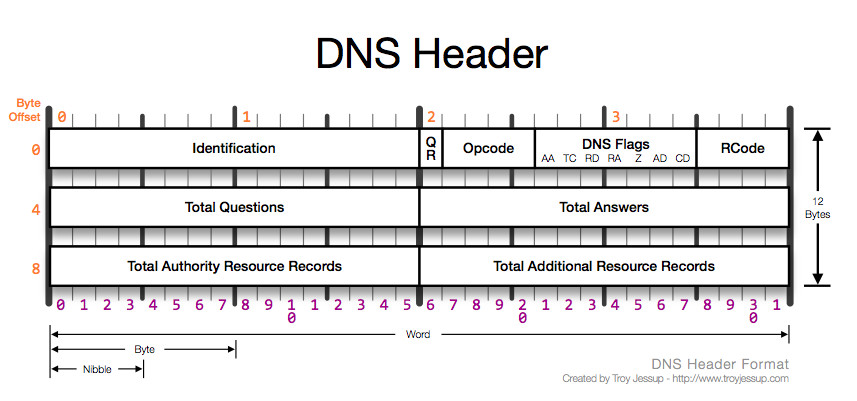
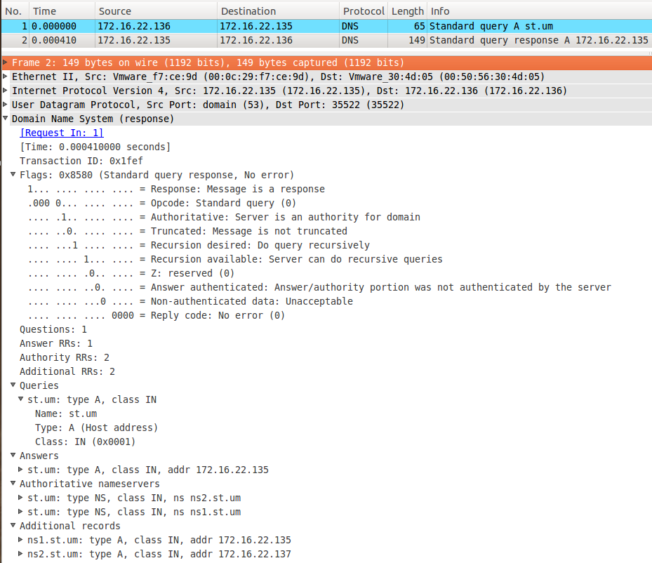
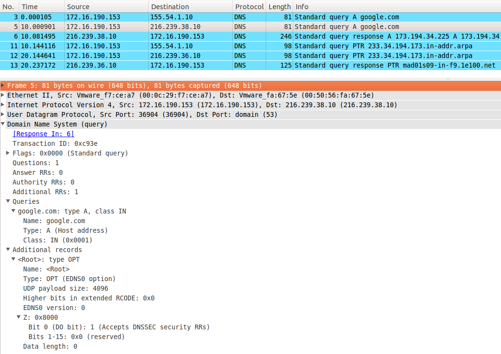
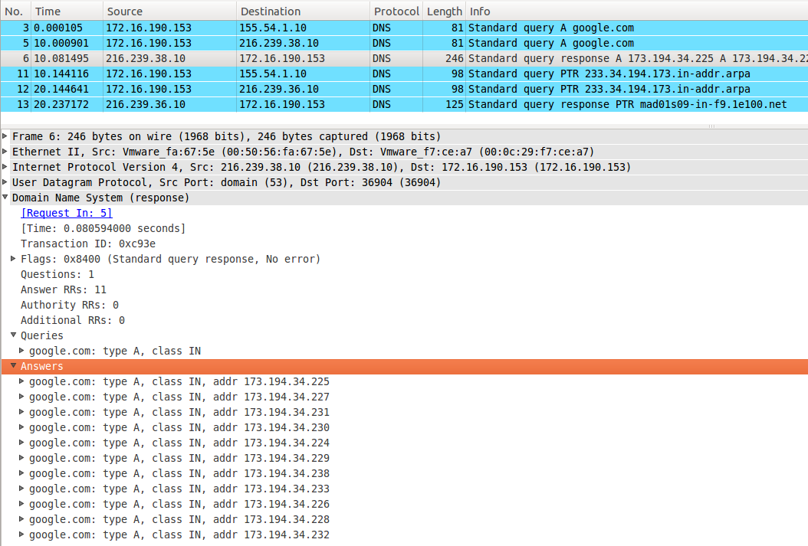

## How DNS works

### Internal query

We called *internal query* when the local DNS can resolve the query. For example, I run `dig st.um` command and look in wireshark what happens:

The client do standard query connection to a default DNS server (my own server). In the header I say that I want to translate `st.um` address (of type `A`)

The server answers me with some useful information:
* In `Answer` section, the server response my query and say 'Hey, the register A of the domain is `172.16.22.135.`
* In `AA nameserver` section it indicates which server answers the query. In this case, my main (`ns1.st.um`) and second (`ns2.st.um`) server.
* In `Additional Record` section it indicates additional information like the IP of the nameservers.

. In the `answer` entry of the header you can see the IP of my request name, and the address for the DNS server that serve the information:

### External query

We called *external query* when local DNS need to consult others DNS nameserver to resolve the query (with iterative or recursive, whatever).

In this case, I send a `ping google.com` and in this process, first I need to translate `google.com` name into a IP name:

The DNS server answers me with a list of availables IPs for `google.com` domain:

Now, I can continue with my ping!
