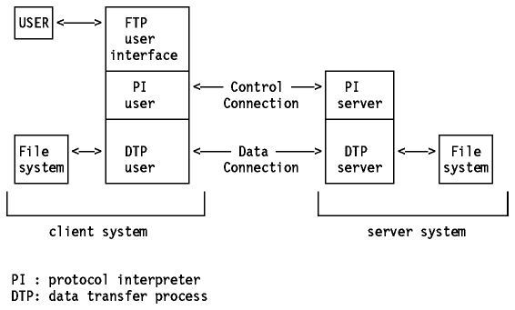
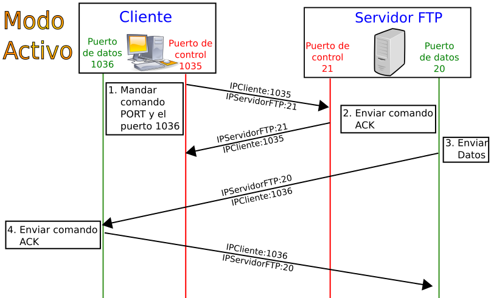
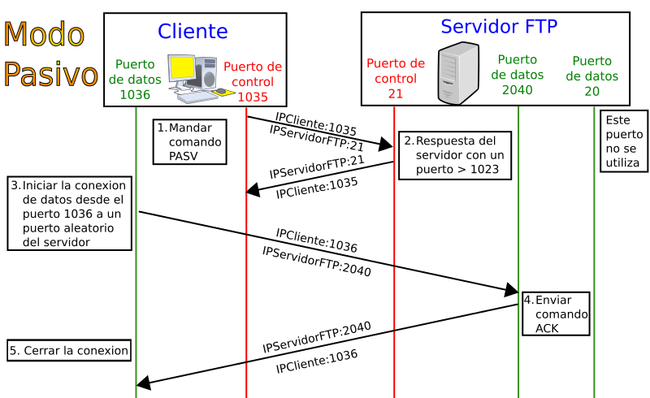

# FTP

The **File Transfer Protocol** (*FTP*) is a standard network protocol used to transfer computer files from one host to another host over a TCP-based network, such as the Internet.

The FTP protocol is divided in two ways: **Protcol interpreter** and **data transfer process**.

In the client, the ports for PI and DTP are not established, it could use any free port. In the server is typical to use port 21 and 20 respectively.
Also, FTP can work in two modes:

**FTP in Active mode**

In active mode, the client has to open a port to communicate with the server.

* Client initiates a connection with server PI and sends the command `PORT` to indicate the port that server needs to initiate a TCP connection.

* Server creates a TCP connection and delegates it in DTP to send the data.

This mode has two inconvenients:

* The client connection is not secure. The client has to accept all the trafic in the port of the data, and this is very dangerous.
* It doesn't work fine if the client has a firewall.

**FTP in Passive mode**

The idea is fixing problem in active mode. In this case, the client negotiates the TCP connection with the server and tells him to open a port for transfer data.

* The process is similar to Active mode but in this case the client sends the command `PASV` to indicate passive mode and the server answers with the port number that can be used. (>1024).
* The client initiates the TCP connection with the server port.

<table class="ccm" cellspacing="0" cellpadding="0" width="550">
<tbody><tr>
<th height="22" colspan="2" width="100%">Access control commands
</th></tr>
<tr>
<th>Command</th>
<th>Description</th>
</tr>
<tr>
<td>USER</td>
<td>Character string that allows the user to be identified. User identification is necessary to establish the communication over the data channel.</td>
</tr>
<tr>
<td>PASS</td>
<td>Character string specifying the user's password. This command must immediately precede the <i>USER</i> command. It falls to the client to hide the display of this command for security reasons.</td>
</tr>
<tr>
<td>ACCT</td>
<td>Character string representing the user's account. The command is generally not necessary. During the response accepting the password, if the response is 230 this stage is not necessary, if the response is 332, it is.</td>
</tr>
<tr>
<td>CWD</td>
<td><i>Change Working Directory</i>: this command enables the current directory to be changed. This command requires the directory's access path

to be fulfilled as an argument.</td>
</tr>
<tr>
<td>CDUP</td>
<td><i>Change to Parent Directory</i>: this command allows you to go back to the parent directory. It was introduced to solve problems of naming the parent directory according to the system (generally "<i>..</i>").</td>
</tr>
<tr>
<td>SMNT</td>
<td><i>Structure Mount</i>: </td>
</tr>
<tr>
<td>REIN</td>
<td><i>Reinitialize</i>: </td>
</tr>
<tr>
<td>QUIT</td>
<td>Command enabling the current session to be terminated. The server waits to finish the transfer in progress if the need arises, then supplies a response before closing the connection.</td>
</tr>
</tbody></table>

<table class="ccm" cellspacing="0" cellpadding="0" width="550">
<tbody><tr>
<th height="22" colspan="2" width="100%">Transfer parameter commands
</th></tr>
<tr>
<th>Command</th>
<th>Description</th>
</tr>
<tr>
<td>PORT</td>
<td>Character string allowing the port number used to be specified.</td>
</tr>
<tr>
<td>PASV</td>
<td>Command making it possible to indicate to the DTP server to stand by for a connection on a specific port chosen randomly from among the available ports. The response to this command is the IP address of the machine and port.</td>
</tr>
<tr>
<td>TYPE</td>
<td>This command enables the type of format in which the data will be sent to be specified.</td>
</tr>
<tr>
<td>STRU</td>
<td>Telnet character specifying the file structure (F for <i>File</i>, R for <i>Record</i>, P for <i>Page</i>).</td>
</tr>
<tr>
<td>MODE</td>
<td>Telnet character specifying data transfer method (S for <i>Stream</i>, B for <i>Block</i>, C for <i>Compressed</i>).</td>
</tr>
</tbody></table>
