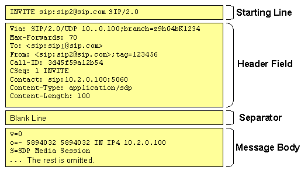
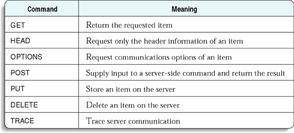
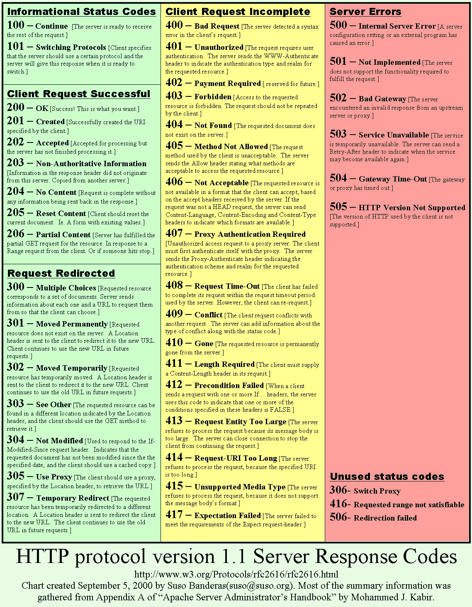

# HTTP

HTTP (short for *HyperText Transfer Protocol*) is the underlying protocol used by the World Wide Web. HTTP defines how messages are formatted and transmitted, and what actions Web servers and browsers should take in response to various commands. For example, when you enter a URL in your browser, this actually sends an HTTP command to the Web server directing it to fetch and transmit the requested Web page.

All parameter of the protocol are specified in the **HTTP header**

Client Request:

```
GET /index.html HTTP/1.1
Host: www.example.com
```

Server Response:

```
HTTP/1.1 200 OK
Date: Mon, 23 May 2005 22:38:34 GMT
Server: Apache/1.3.3.7 (Unix) (Red-Hat/Linux)
Last-Modified: Wed, 08 Jan 2003 23:11:55 GMT
ETag: "3f80f-1b6-3e1cb03b"
Content-Type: text/html; charset=UTF-8
Content-Length: 131
Accept-Ranges: bytes
Connection: close

<html>
<head>
  <title>An Example Page</title>
</head>
<body>
  Hello World, this is a very simple HTML document.
</body>
</html>
```

A message in HTTP have 3 parts:

1. First line with *HTTP_Method*, *Resource ID* adn  *HTTP Version*.
2. Information about the client and the petition.
3. Body request if the client need to transfer data to the server.



The HTTP methods are different for different actions:



And each client request is response with status code:

* **1xx** Informational
* **2xx** Success
* **3xx** Redirection
* **4xx** Client Error
* **5xx** Server Error

Special mention to:

```
418 I'm a teapot (RFC 2324)
This code was defined in 1998 as one of the traditional IETF April Fools' jokes, in RFC 2324, Hyper Text Coffee Pot Control Protocol, and is not expected to be implemented by actual HTTP servers.
```


