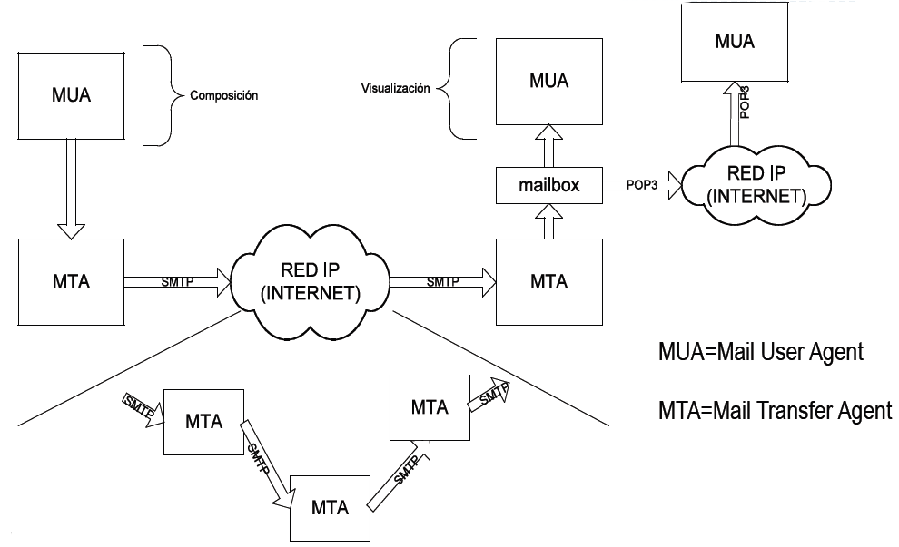

# Mail

Mail is the basic, oldest and most popular service of the Internet.

When you want to send a mail, you are going to put the mail in the received mailbox of the receiver, but then we have a little problem: we don't know the destination mailbox adress.

If we want to know it, we need to use a DNS query from the server name of the mailbox adress, and it will say you the direction where you can send the mail. The process is similar when you want to check your mail account. You can see this later when we analyze the traffic with wireshark.

For supporting mail, you'll need to support DNS before. This is because mail is based on mailbox concept: Every mail accounts need a mailbox for send (**SMTP**) and receive (**POP3** or **IMAP**).

**SMTP**

Defines the necssary protocol that transmits the message to the mailbox.

The options about how the message has to be interpreted are described in the **MIME** header.

`Content-Transfer-Encoding` avoids problems relaying the message for differents MTA. It can be:

* base64
* quoted-printable
* 7bit
* 8bit
* binary

The `Content-Type` can be:

* text
* image
* audio
* video
* applitacion
* message
* multipart

It's necesary define `Content-Type` for multipart messages that contain different types (for example text and attachment)

**POP3**

**IMAP**

IMAP keeps more stuff in the server, for example, folder structure or messages you want to recover.

The protocol establishes different states for the connection. Internally, when the connection is established, the server interprets the command that is contained in the messages and it does the actions:

