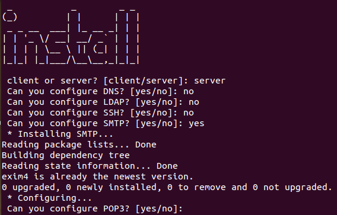
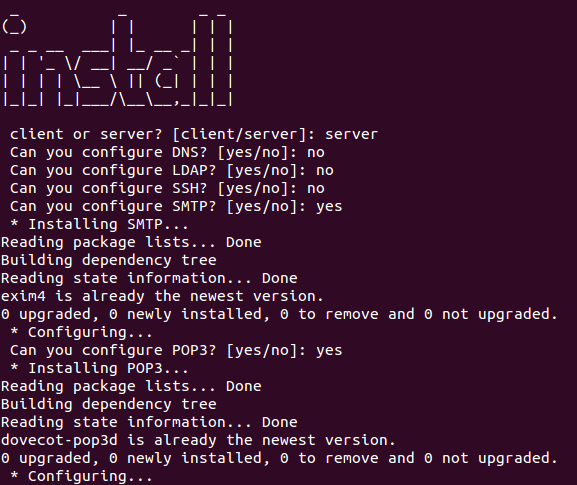

# Your Mail in the server

we will set up two typical services for mail:

* **SMTP** is the protocol to can send emails.
* **POP3** is one of the posibles protrocols to receive mails that we are to use. The other common protocol is **IMAP**.


The differences between POP3 and IMAP are littles but importants:


<table border="1" cellspacing="1" cellpadding="7" width="568">
  <tbody><tr>
    <td width="50%" valign="top" bgcolor="#FFFFFF" background="bg.gif">
      <p align="center"><b>POP3</b></p></td>
    <td width="50%" valign="TOP" bgcolor="#ffffff" background="bg.gif">
      <p align="center"><b>IMAP</b></p></td>
  </tr>
  <tr>
    <td width="50%" valign="TOP">Since email needs to be downloaded into
      desktop PC before being displayed, you may have the following problems for
      POP3 access:
      <ul>
        <li>You need to download all email again when using another desktop PC
          to check your email.</li>
        <li>May get confused if you need to check email both in the office and
          at home.</li>
      </ul>
      <p>The downloaded email may be deleted from the server depending on the
      setting of your email client.</p></td>
    <td width="50%" valign="TOP">Since email is kept on server, it would gain
      the following benefits for IMAP access:
      <ul>
        <li>No need to download all email when using other desktop PC to check
          your email.</li>
        <li>Easier to identify the unread email.</li>
      </ul>
    </td>
  </tr>
  <tr>
    <td width="50%" valign="TOP">All messages as well as their attachments will
      be downloaded into desktop PC during the 'check new email' process.</td>
    <td width="50%" valign="TOP">A whole message will be downloaded only when it
      is opened for display from its content.</td>
  </tr>
  <tr>
    <td width="50%" valign="TOP">Mailboxes can only be created on desktop PC.
      There is only one mailbox (INBOX) exists on the server.</td>
    <td width="50%" valign="TOP">Multiple mailboxes can be created on the
      desktop PC as well as on the server.</td>
  </tr>
  <tr>
    <td width="50%" valign="TOP">Filters can transfer incoming/outgoing messages
      only to local mailboxes.</td>
    <td width="50%" valign="TOP">Filters can transfer incoming/outgoing messages
      to other mailboxes no matter where the mailboxes locate (on the server or
      the PC).</td>
  </tr>
  <tr>
    <td width="50%" valign="TOP">Outgoing email is stored only locally on the
      desktop PC.</td>
    <td width="50%" valign="TOP">Outgoing email can be filtered to a mailbox on
      server for accessibility from other machine.</td>
  </tr>
  <tr>
    <td width="50%" valign="TOP">Messages are deleted on the desktop PC.
      Comparatively, it is inconvenient to clean up your mailbox on the server.</td>
    <td width="50%" valign="TOP">Messages can be deleted directly on the server
      to make it more convenient to clean up your mailbox on the server.</td>
  </tr>
  <tr>
    <td width="50%" valign="TOP">Messages may be reloaded onto desktop PC
      several times due to the corruption of system files.</td>
    <td width="50%" valign="TOP">The occurrence of reloading messages from the
      server to PC is much less when compared to POP3.</td>
  </tr>
</tbody></table>

## Configuring POP3



1. Install the service **dovecot** for use POP3 in your server.
2. Configure defaults options in `/etc/dovecot/conf.d/10-auth.conf` and `/etc/dovecot/conf.d/10-mail.conf`.

## Configuring SMTP



1. Install the service **exim4**
2. Configure standards options in `/etc/exim4/update-exim4.conf.conf` about your DNS:

```
dc_eximconfig_configtype='internet'
dc_other_hostnames='$DNS_NAME'
dc_local_interfaces=''
dc_readhost=''
dc_relay_domains='$RELAY_DOMAINS'
dc_minimaldns='false'
dc_relay_nets='$LOCAL_NETWORK'
dc_smarthost=''
CFILEMODE='644'
dc_use_split_config='false'
dc_hide_mailname=''
dc_mailname_in_oh='true'
dc_localdelivery='maildir_home'
```