##  How Mail Works

### SMTP

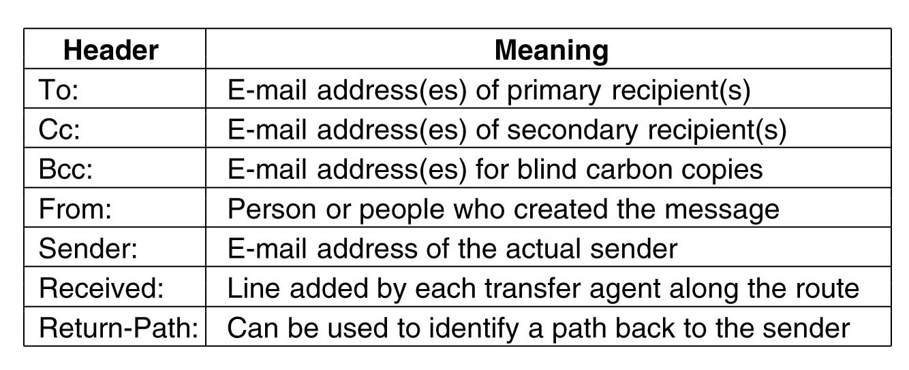

Resume

1) Server presentation

2) Client HELO and sending his IP

3) Server reply

4) Client FROM mail account

5) Server reply

6) Client send RCTP mail account

7) Server reply

8) Client prepare to send DATA

9) Server reply and say that write a "." to finish the message

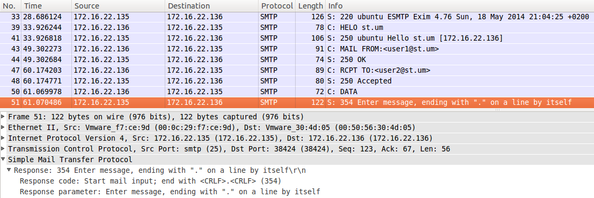

10) Client send the text of the message

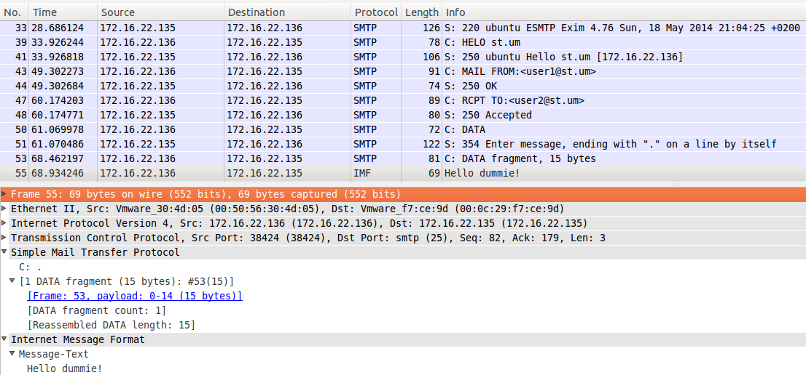

11) Server reply when the client finish to send the message

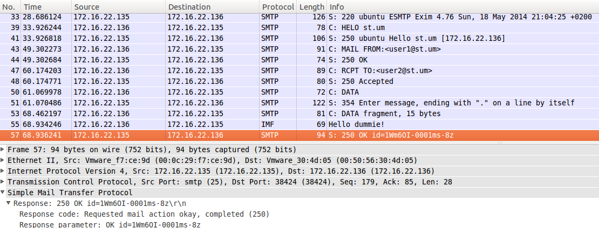

12) Client termiante the connection

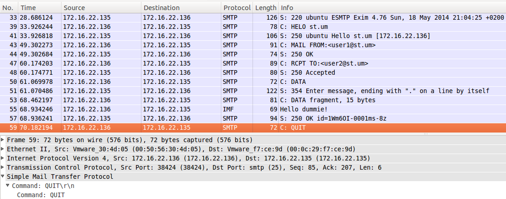

13) Server reply

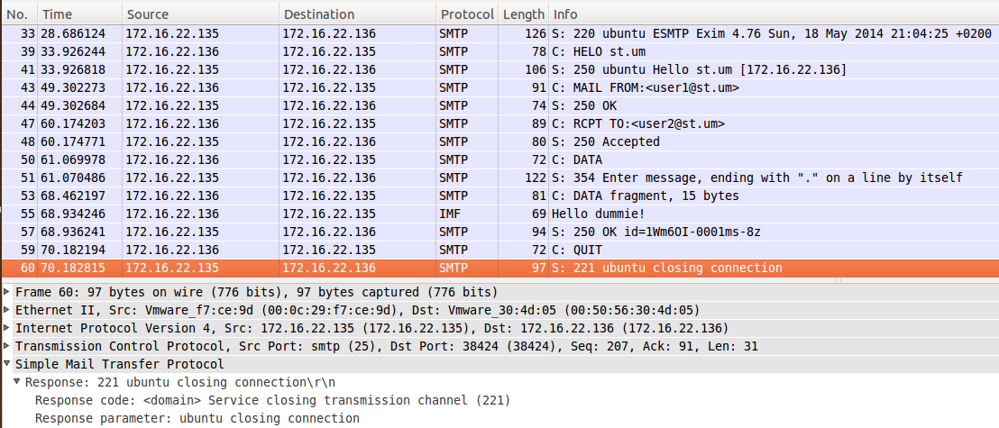

### POP3

The most commonly used commands in a POP3 connection are the following:

> **USER <username>**
> **PASS <password>**
> Command to make login with username and password. The server will answer if the login is correct or not.
>
> **STAT**
> STAT simply answers with a single line consisting of two numbers: the number of messages in the box and the total size of those messages in bytes. It's useful for human beings, but less so for automatic clients, which are likely to jump straight to the LIST command.
>
> **LIST**
> LIST lists the contents of the mailbox, naturally enough. It does so by using the standard POP3 multi-line response format. Here's an example:
>   LIST
>   +OK Mailbox contents follow
>   1 7774
>   2 513
>   3 10493
>   .
> The terminating line is a period on a line by itself, which is pretty standard for mail protocols in general. Each line consists of the mail message number (if you delete one, it won't appear in the list, so don't fall into the trap that the numbers are sequential and can thus be ignored!) followed by the size of the message in bytes.
> LIST plus a message number will simply act like STAT for that message.
>
> **RETR msg**
> RETR retrieves a message. Use the message number from LIST. Note that you'll receive the true text of the message, headers followed by a blank line followed by the body, followed by a period on a line by itself. If the body actually contains a period on a line by itself, the mail server will already have doubled that period. So your client needs to undouble it.
>
> **DELE msg**
> DELE deletes a message. It won't actually be deleted until you QUIT the session, and you can undelete everything you've deleted (in case of a mistake) by using RSET.
>
> **RSET**
> You can reset the session to its initial state using the RSET command. This will undelete all messages deleted using DELE.
>
> **TOP msg n**
> TOP is actually an optional command, but most servers support it now. It returns the headers of message msg plus n lines of the body. If n is zero, of course, you just get the headers, which is nice for doing filtering without having to get the entire message.
>
> **QUIT**
> QUIT terminates the session and deletes any messages marked with DELE.

Resume

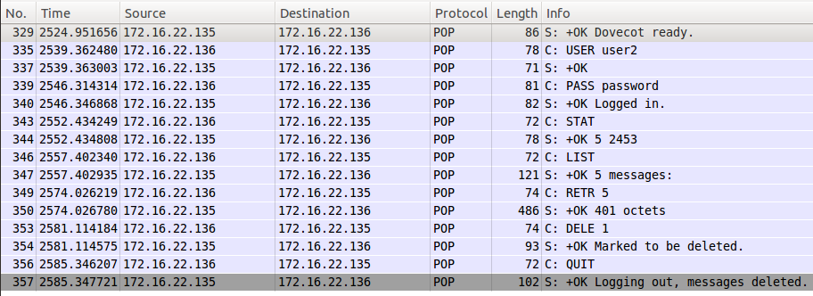

1) Server presentation2.

2) Client identify with USER command

3) Server reply

4) Client type password with PASS command

5) Server reply and say that loggin is correct

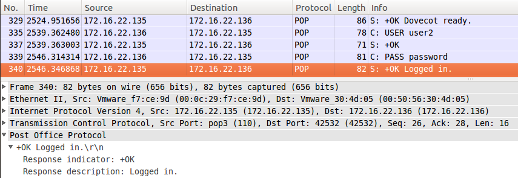

6) Client use STAT command

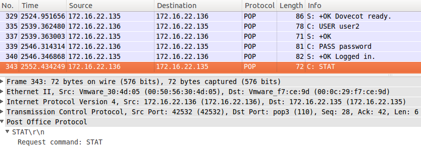

7) Server Reply

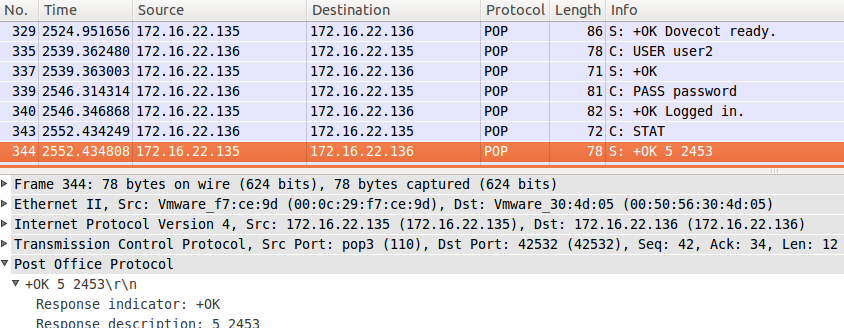

8) Client use LIST command

9) Server reply with list of messages

10) Client say that want to see the message No.5

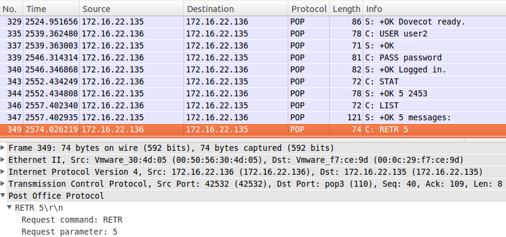

11) Server reply with the message content
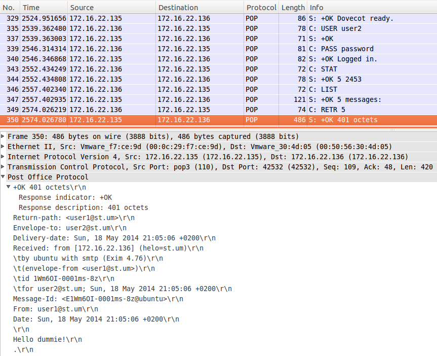

12) Client use DELE command

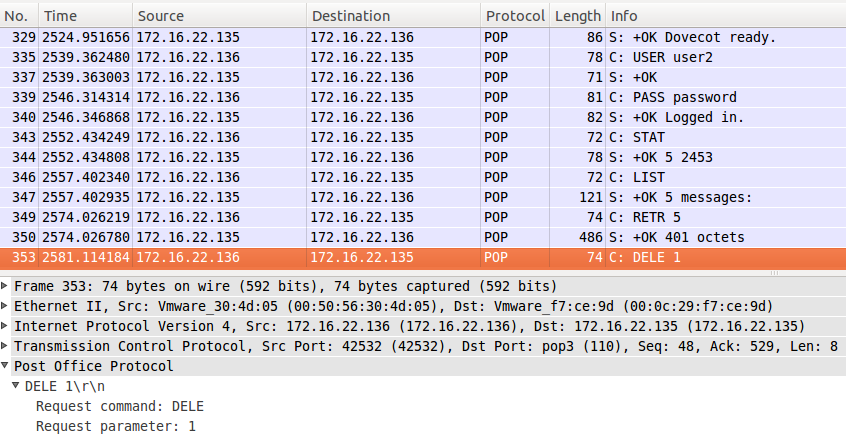

13) Server reply

14) Client use QUIT command for desconnection

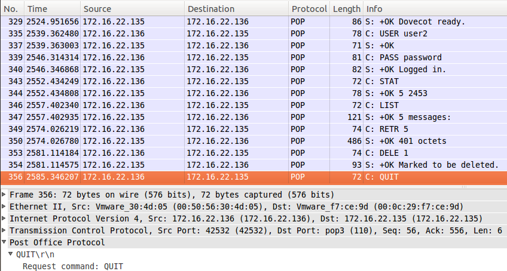

15) Server reply

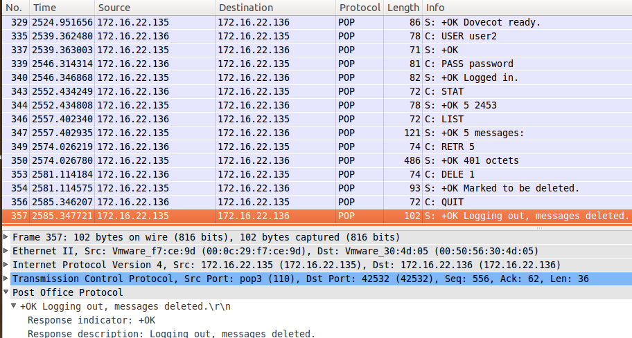
