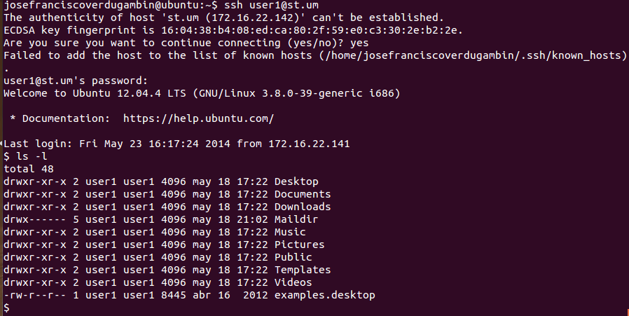

# Your SSH in the client

The client needs **openssh-client** that is usually installed on UNIX systems default

Also need to generate a **SSH public key** to identify the computer. SSH keys are a way to identify trusted computers, without involving passwords.

**Check your SSH keys**

```
cd ~/.ssh
ls -al
# Lists the files in your .ssh directory
```

**Generate a new SSH key**

```
ssh-keygen -t rsa -C "your_email@example.com"
# Creates a new ssh key, using the provided email as a label
# Generating public/private rsa key pair.
# Enter file in which to save the key (/Users/you/.ssh/id_rsa): [Press enter]
Enter passphrase (empty for no passphrase): [Type a passphrase]
# Enter same passphrase again: [Type passphrase again]
Your identification has been saved in /Users/you/.ssh/id_rsa.
# Your public key has been saved in /Users/you/.ssh/id_rsa.pub.
# The key fingerprint is:
# 01:0f:f4:3b:ca:85:d6:17:a1:7d:f0:68:9d:f0:a2:db your_email@example.com
```

Now you can connect with your server with `ssh` command:


