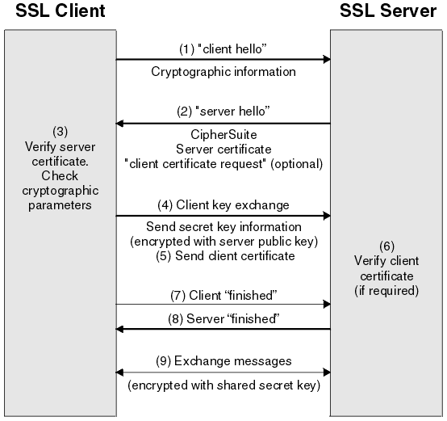

# SSL

SSL (*Secure Sockets Layer*) is the standard security technology for establishing an encrypted link between a web server and a browser. This link ensures that all data passed between the web server and browsers remain private and integral. SSL is an industry standard and is used by millions of websites in the protection of their online transactions with their customers.

SSL does two things:

1. **Authenticates the server to the client.** (*Handshake*)
2. Encrypts your HTTP session.

We go to explain **Handshake** process:

* Client send `clientHello` message specifying encrypted options: SSL version, compress method,... and sending random numbers that they use later.
* The server receive the message and select:
	* What simetric algorythm (**secret key**) use (e.g. [AES](https://en.wikipedia.org/wiki/Advanced_Encryption_Standard), [3DES](https://en.wikipedia.org/wiki/Triple_DES), [RC5](https://en.wikipedia.org/wiki/RC5)).
	* What asimetric algorythm (**public key**) use (e.g. [RSA](wiki/RSA_(cryptosystem), [Diffie-Hellman](https://en.wikipedia.org/wiki/Diffie%E2%80%93Hellman_key_exchange)).
	* What MAC algorythm use ([SHA](https://en.wikipedia.org/wiki/Secure_Hash_Algorithm)).

Why select simetric and asimetric algorythm? Why not use only one?

When client finally send data to the server, they use simetric algorythm, but first, to get it, they need to negotiate and exchange confidence information. This proceed is known as **Pre Master Key**.

There are two ways to do Pre Master Key process:

1. With **Diffie-Helman**: Client and server exchange `SERVER_KEY_EXCHANGE` and `CLIENT_KEY_EXCHANGE` and both parts know 	the information to operate with simetric algorythm.

2. With **RSA**: The client catch the public key of the Server Certificate (message `CERTIFICATE`)and encrypted the master key. Only the server can desncrypted this with her private key.

And send to the client `serverHello` with this options, distinctive server number and their certificates to check the identify of the server domain.

But, one moment... Why am I going to trust the server? and if not who he claims to be?

Before Pre Master Key process is necessary for the server to authenticate it, for do it is also necessay asimetric algorythm, normally with RSA. And then, thec MAC algorythm is use to verify that data of the session is authenticathed.

We can resume all the process with two variants of message:

* **TLSv1_RSA_WITH_AES_128_CBC_SHA**
	- **TLSv1**: version of TLS (SSL protocol)
	- **RSA**: For server authentication and pre master key process.
	- **AES**: For simetric algorythm after master key
	- **SHA**: For MAC encryptation

* **TLSv1_DHE_RSA_WITH_AES_256_CBC_SHA**
	- **TLSv1**: version of TLS (SSL protocol)
	- **DHE**: For server authentication based of Diffie-Helman for pre master key.
	- **RSA**: For server authentication.
	- **AES**: For simetric algorythm after master key.
	- **SHA**: For MAC encryptation.

The resume of the process in one image:

The complexities of the SSL protocol remain invisible to your customers. Instead their browsers provide them with a key indicator to let them know they are currently protected by an SSL encrypted session - the lock icon in the lower right-hand corner, clicking on the lock icon displays your SSL Certificate and the details about it. All SSL Certificates are issued to either companies or legally accountable individuals.