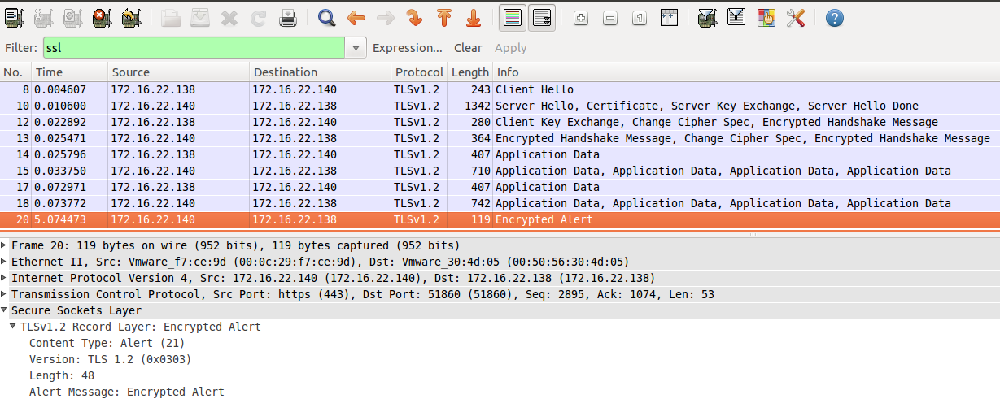

## How SSL Works

Resume of the process:

Resume of messages:

1) Client sends `HELLO` message with a distinctive random number and information about what compression and Cipher suites support and request to the server the X509 certificate to trust him.

2) The server receives the message and:

1. Reads the `HELLO` message of the client and select the session options.
2. Sends to the client the certificate to show that you can trust him.
3. Does `SERVER_KEY_EXCHANGE` as part of the process of Pre Master Key.

3) Client receives server message and proceeds to:

1. Validate the identity of the server.
2. Do `CLIENT_KEY_ECHANGE` as part of the process of Pre Master Key.

At this moment the client can calculate the **Master Key**.

4) Server receives client message and it's able to calculate **Master Key**. From here both parts have a shared secret.

5) The information from here can travel encrypted. It's not posible to see the data content.

