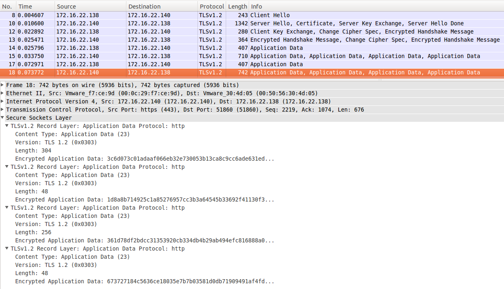

# How SSL Works

Resume of the process:

Resume of messages:

1) Client send `HELLO` message with distinctive random number and information about what compression and Cipher suites support and request to the server the X509 certificate to trust him.

2) The server receive the message and:

1. Read the `HELLO` message of the client and select the options of the session.
2. Send to the client the Certificate to show that you can trust him.
3. do `SERVER_KEY_EXCHANGE` as part of the process of Pre Master Key

3) Client receive server message and proceed to:

1. Validate the identity of the server.
2. do `CLIENT_KEY_ECHANGE` as part of the process of Pre Master Key.

at this moment client can be calculate the **Master Key**.

4) Server receive client message and can calculate **Master Key**. From here both part have a shared secret

5) The information from here can travel encrypted. Is not posible see the data content

